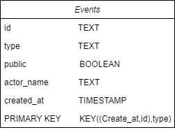

# Data Modeling II

## Project implementation instruction

## Get started
```sh
$ cd 02-data-modeling-ii
```

## create visual environment & install required libraries
```sh
python -m venv ENV
source ENV/bin/activate
pip install -r requirements.txt
```

## Running cassanda

```sh
docker-compose up
```

## Data model in cassandra
| created_at | id | type | actor_name | public |
| :---         |     :---:      |      :---:      |     :---:      |         ---: |
| datetime.datetime(2022, 8, 17, 15, 52, 40)   | 23487963522     | PushEvent    |tiltingpenguin | True |
| datetime.datetime(2022, 8, 17, 15, 53, 42)   | 23487985321     | PullRequestReviewEvent    |by-d-sign | True |

## Data stucture

Partition Key: create_at, Id
Clustering Key: Type


## To shutdown cassanda

To shutdown, press Ctrl+C and run:

```sh
docker-compose down
```

## Table Diagram
