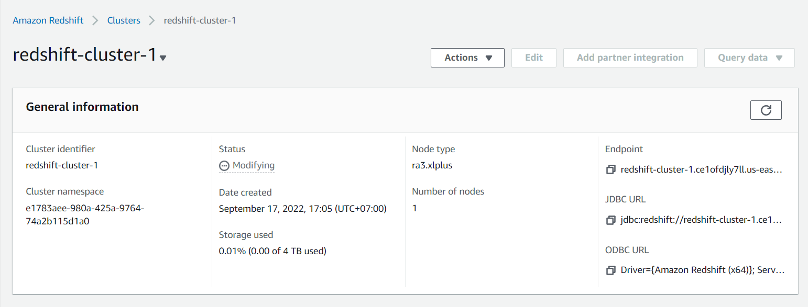

# Data Modeling III Building a Data Warehouse

## Project implementation instruction

## Get started
```sh
$ cd 03-building-a-data-warehouse
```

## Getting Started

```sh
python -m venv ENV
source ENV/bin/activate
pip install -r requirements.txt
```

## Connect with AWS redshift
```sh
Step:1
Crate a redshift claster


